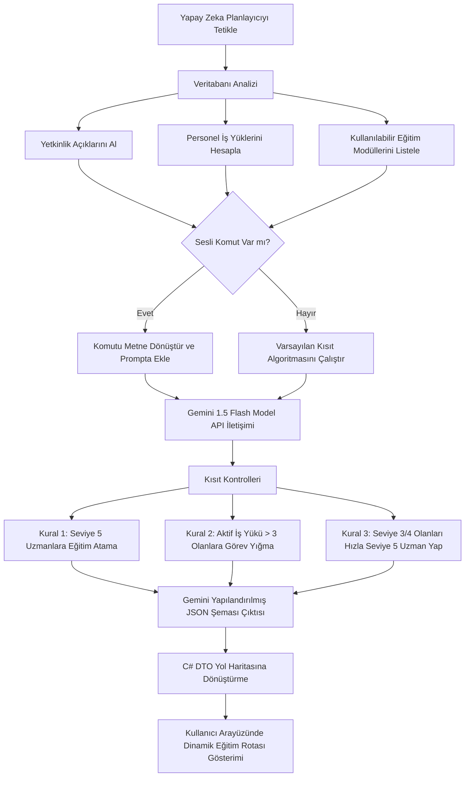

# MroPlan - Akademik Poster Sunumu Grafik ve Tasarım Rehberi

Bu rehber, **MroPlan (AI-Powered Aviation MRO & Workforce Planning)** projenizin mezuniyet/bitirme sergisi **Poster Sunumu (A0/A1 Boyut)** için ihtiyaç duyacağınız grafik şemalarını, görsel yerleşim planını ve teknik detayları içerir.

---

## 📐 Akademik Poster Blok Düzeni (A0 / A1)

Etkili bir akademik posterde veri yoğunluğu yüksek, okunabilir ve akıcı bir yerleşim olmalıdır. Aşağıdaki yerleşim şablonu jüri üyelerinin projeyi soldan sağa ve yukarıdan aşağıya kolayca anlamasını sağlar:

```
+---------------------------------------------------------------------------------+
|                                 AFİŞ BAŞLIĞI                                    |
|             (MroPlan: Yapay Zeka Destekli Havacılık Bakım Planlama Platformu)    |
+------------------------------------+--------------------------------------------+
|  BLOK 1: ÖZET VE PROBLEM TANIMI   |  BLOK 4: YAPAY ZEKA ALGORİTMASI VE AKIŞI   |
|  * Havacılıkta bakım gecikmeleri  |  * Gemini API Yapay Zeka Motoru            |
|  * İnsan faktörlü atama hataları   |  * Kısıt Algoritması (İş Yükü ve Seviye)   |
|  * Yetkinlik matrisi eksiklikleri  |  * [GRAFİK 2: AI KARAR AĞACI ŞEMASI]       |
+------------------------------------+--------------------------------------------+
|  BLOK 2: SİSTEM MİMARİSİ VE AKIŞI  |  BLOK 5: DENEYSEL SONUÇLAR VE GRAFİKLER    |
|  * ASP.NET Core Blazor Server      |  * Atölye Doluluk Oranları Kıyaslaması     |
|  * Entity Framework & MS SQL       |  * Personel Standart Süre Sapma Katsayıları|
|  * [GRAFİK 1: MİMARİ VE VERİ AKIŞI]|  * [GRAFİK 4: DARBOĞAZ VE PERFORMANS MAP]  |
+------------------------------------+--------------------------------------------+
|  BLOK 3: EĞİTİM-OPERASYON KÖPRÜSÜ  |  BLOK 6: PROJE ÇIKTILARI VE ETKİ ANALİZİ   |
|  * Personel Yetkinlik Seviyeleri   |  * Ortalama helikopter duruş süresinde azalış|
|  * Otomatik Veritabanı Güncelleme  |  * Bakım atama veriminde %25+ artış        |
|  * [GRAFİK 3: KÖPRÜ DÖNGÜ ŞEMASI]  |  * Sonuç, Teşekkür ve İletişim             |
+------------------------------------+--------------------------------------------+
```

---

## 📊 Önerilen 4 Temel Poster Grafiği ve Detayları

### 🌐 Grafik 1: Sistem Mimarisi ve Entegre Veri Akış Şeması
*   **Görsel Konsepti:** Kullanıcının (Planlayıcının) tarayıcı arayüzünden başlayarak Blazor Server backend katmanına, oradan Entity Framework Core ile SQL Veritabanına ve dış servis olarak Gemini AI API'ye bağlanan entegre mimari.
*   **Poster İçeriği:** 
    *   **İstemci (Client):** MudBlazor UI (Siber Arayüz, Helikopter Teşhis Paneli).
    *   **Sunucu (Server):** C# ASP.NET Core Blazor, `BakimService`, `YetkinlikService`.
    *   **Veri Katmanı (Data):** ApplicationDbContext (SQL Server), `Personeller`, `Yetkinlikler`, `BakimKontrolKayitlari` tabloları.
    *   **Yapay Zeka (AI):** Google Gemini API bağlantısı (Structured JSON output akışı).

---

### 🧠 Grafik 2: Yapay Zeka (Gemini) Karar Ağacı ve Kısıt Algoritması
*   **Görsel Konsepti:** `GeminiService.cs` içerisindeki akıllı planlama karar mekanizmasının akış şeması. Jürinin en çok ilgisini çekecek mühendislik şemasıdır.
*   **Akış Adımları:**


---

### 🔄 Grafik 3: Eğitim-Operasyon Köprüsü Döngü Şeması
*   **Görsel Konsepti:** Bakım esnasında ortaya çıkan yetkinlik eksikliğinin eğitimle kapatılarak veritabanında tekrar operasyonel güce dönüşmesini gösteren dairesel döngü (Continuous Loop).
*   **Döngü Aşamaları:**
    1.  **Arıza/Kabul Aşaması:** Hangara helikopter girer, parça arızası tespit edilir.
    2.  **Açık Tespiti:** O parçayı onaracak yeterli `Seviye 5 (Uzman)` personel bulunamadığı için sistemde **Kritik Yetkinlik Açığı** tetiklenir.
    3.  **Yapay Zeka Müdahalesi:** AI Planner, uygun personeli seçip **Eğitim Modülüne** atar.
    4.  **Eğitim Tamamlama:** Teknisyen eğitimi tamamlar, pratik görevi başarıyla bitirir.
    5.  **DB Güncellemesi:** EF Core aracılığıyla `Yetkinlik.YetkinlikSeviyesi` veritabanında otomatik olarak `SV5` seviyesine yükseltilir.
    6.  **Operasyonel Hazırlık:** Personel işe atanır, helikopter hangardan başarıyla çıkar.

---

### 📊 Grafik 4: Atölye Doluluk ve Kapasite Limit Analiz Grafiği
*   **Görsel Konsepti:** Projenizin **matematiksel modelleme** gücünü gösteren grafiktir.
*   **Detaylar:**
    *   **Kapasite Formülü:** $Kapasite = Aktif\,Personel \times 480\,dk \times 0.85\,Verimlilik$
    *   **İş Yükü Formülü:** $İş\,Yükü = Aktif\,Bakımlar \times (Hazırlık\,Süresi + İşlem\,Süresi)$
    *   **Grafik Tasarımı:** X ekseninde Atölyeler (Motor, Aviyonik, Mekanik vb.), Y ekseninde Man-Hour cinsinden Kapasite. Her atölyenin üzerinde anlık iş yükü barları ve tepede **%85 Kritik Kapasite Limit Çizgisi (Kırmızı)**.
    *   **Önemi:** Projenizin sadece statik bir web sitesi olmadığını, arkasında havacılık planlama matematiği (Yöneylem Araştırması) barındırdığını kanıtlar.

---

## 💡 Poster Sunum Günü İçin Taktikler ve Jüri İletişimi

*   **Görsel Odak:** Postere yaklaşan bir hocaya ilk olarak hazırladığımız **`mro_plan_poster_semasi.png`** üzerindeki helikopter şemasını ve Gemini AI bağlantısını gösterin. Bu, projenin kapsamını 5 saniyede anlatacaktır.
*   **Akış Vurgusu:** Sunumu yaparken sürekli *"Sayfa tasarladık"* demek yerine **"Veri Akış Döngüsünü"** (Grafik 3) anlatın. Bir uçağın kabulünden, arızanın tespitine, AI'ın eğitim atamasına ve uçağın uçuşa hazır hale gelişine kadarki yaşam döngüsünü poster üzerinden parmağınızla takip ederek anlatın.
*   **Mühendislik Katma Değeri:** Kısıt algoritmasını (Grafik 2) vurgulayarak, yapay zekanın rastgele atamalar yapmadığını, iş yükü sınırlarına ve yetkinlik kurallarına göre optimize edilmiş matematiksel kararlar verdiğini belirtin.
